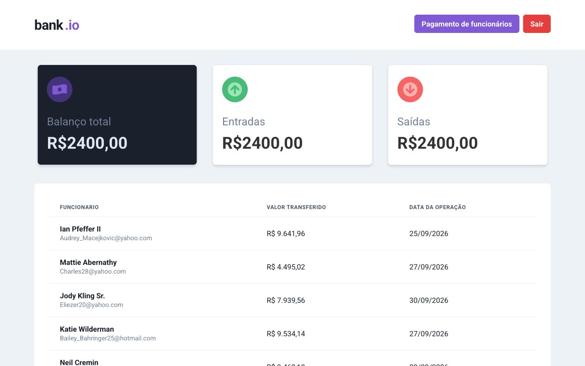

# Bank App

A small bank dashboard I built in April 2022 for a hiring challenge: log in,
see the last seven days of transfers, and pay employees through a three-step
wizard. There is no backend; MirageJS intercepts the requests and answers with
data generated by faker, so the whole thing runs in the browser.



## Running it

```bash
yarn
yarn dev --port 3000
```

Open http://localhost:3000 and sign in with `admin@mail.com` / `123`. The
port matters: the mock API is addressed as `localhost:3000/api`, so the dev
server has to be there for Mirage to catch the calls.

`yarn build` produces a static bundle in `dist/`.

## What's in it

- React 18 with Vite, TypeScript, Chakra UI for the components.
- React Hook Form and Yup on the login and on every step of the wizard.
- The wizard keeps its state in a context (`src/contexts/PaymentWizardContext.tsx`)
  so each step is its own component and the summary at the end reads from one
  place.
- `react-table` for the transactions list, with employees joined onto
  transactions inside the Mirage route, the way a real API would.
- A protected route that sends you back to the login when there is no session.

## What's missing

- Tests. The challenge did not ask for them and I was on a clock.
- Type checking does not pass cleanly: the `react-table` typings and the
  Mirage schema types drifted from the code. Vite builds it regardless, so the
  build script runs `vite build` only.
- The UI text is in Portuguese; the challenge was for a Brazilian company.
